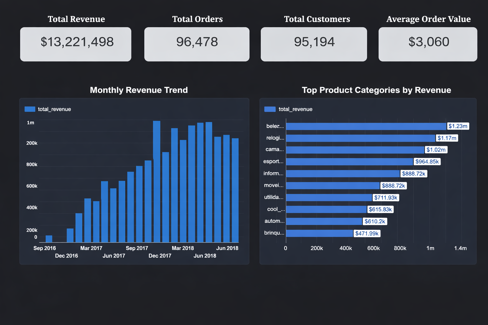
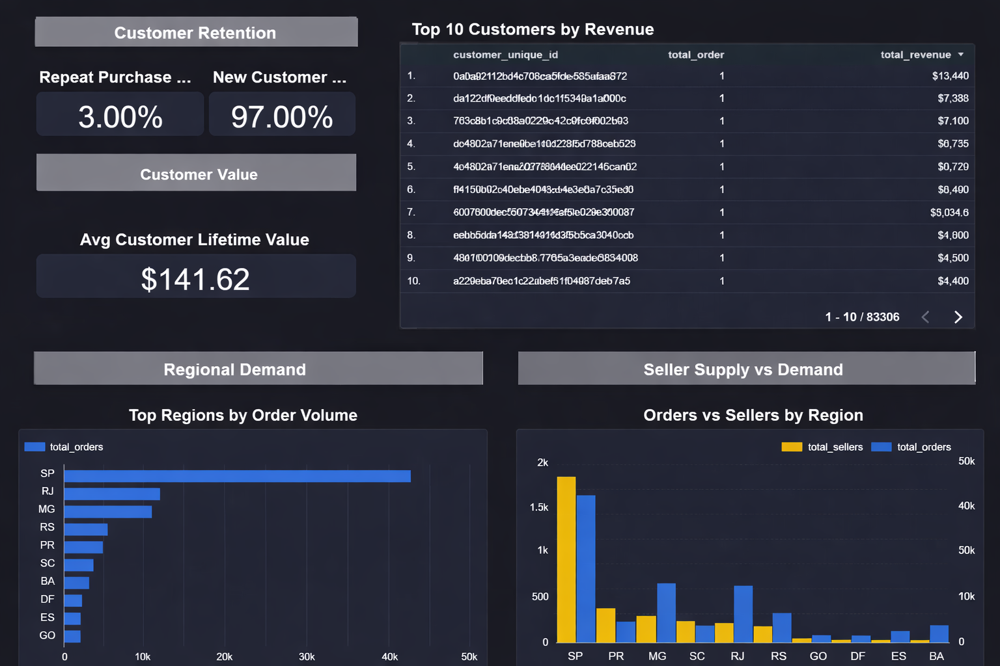

# E-Commerce Sales & Customer Performance Analysis

## Project Overview
This project is an end-to-end business analytics case study focused on understanding
sales performance, customer behavior, retention, and regional demand in an e-commerce
environment.

The analysis emphasizes SQL-based KPI creation and dashboard-driven business insights,
rather than raw data processing or engineering pipelines.

---

## Business Objectives
- Track overall sales and revenue performance
- Identify high-performing product categories
- Measure customer retention and repeat purchase behavior
- Evaluate customer lifetime value
- Analyze regional demand versus seller availability

---

## Dataset
- Source: Olist Brazilian E-Commerce Dataset (Kaggle)
- Time Period: 2016–2018
- Data Scope: Orders, customers, products, sellers, payments

Raw data was transformed into clean analytical KPI datasets using SQL.

---

## Tools & Technologies
- SQL (PostgreSQL) – data cleaning, transformations, KPI logic
- Looker Studio – dashboard visualization
- CSV – analytical data outputs
- GitHub – documentation and version control

---

## Analytical Workflow
1. Raw tables analyzed and profiled in SQL
2. Business KPIs designed based on stakeholder-style questions
3. Clean KPI datasets created for BI consumption
4. Dashboards built using Looker Studio CSV connectors

---

## Key KPIs Created
- Monthly Sales & Revenue Trends
- Product Category Performance
- Customer Lifetime Value
- Repeat Purchase Rate
- Regional Demand vs Seller Supply

SQL logic for all KPIs is available in:
Sql/Kpi's

---

## Dashboard Summary

### Page 1 – Sales Performance Overview

**Key metrics and visuals:**
- Total Revenue
- Total Orders
- Total Customers
- Average Order Value
- Monthly Revenue Trend
- Top Product Categories by Revenue

---

### Page 2 – Customer & Regional Insights

**Key metrics and visuals:**
- Repeat Purchase Rate
- New Customer Rate
- Average Customer Lifetime Value
- Top 10 Customers by Revenue
- Regional Demand vs Seller Supply

---

## Key Business Insights
- Revenue growth shows clear monthly trends
- A small set of categories contributes most revenue
- Customer base is heavily driven by new customers
- Repeat purchase rate is relatively low
- Regional demand and seller availability are imbalanced

---

## Project Structure
ecommerce-sales-customer-performance/
├── sql/
├── data/clean/
├── dashboards/
├── screenshots/
└── README.md

---

## Author
Ayush Kandwal  
Business & Data Analyst (Fresher)

---

## Notes
This project was built as a portfolio initiative to demonstrate business analytics
thinking, SQL proficiency, and dashboard storytelling using real-world data.
